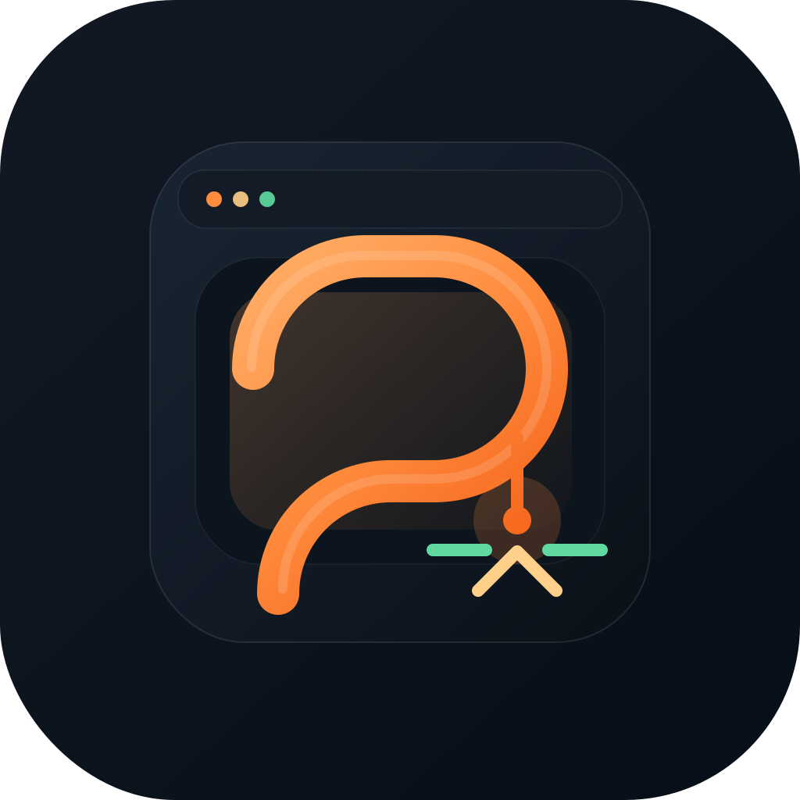
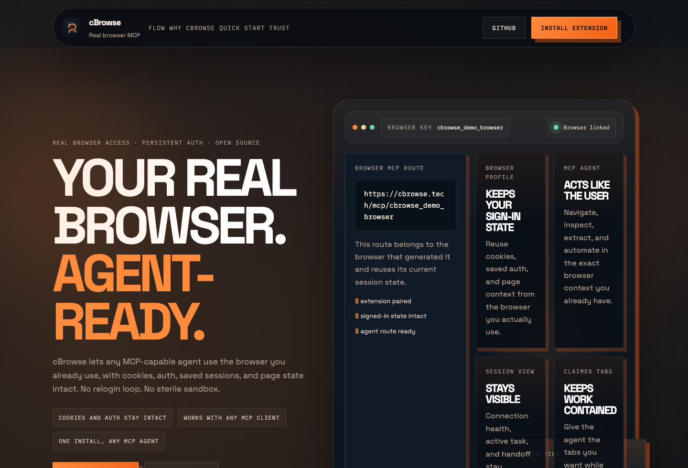

<p align="center">
  
</p>

<h1 align="center">cBrowse</h1>

<p align="center">
  <strong>Let AI use the browser you're already signed into.</strong><br />
  Real-browser MCP access with cookies, auth, tabs, and page state intact.
</p>

<p align="center">
  
</p>

cBrowse connects MCP-capable AI agents to the actual browser profile a user already uses.

It pairs a Chrome extension with a browser-specific MCP endpoint so the agent can work with existing cookies, saved logins, open tabs, and page state instead of launching a blank automation browser.

- Reuse cookies, auth, and site state from the signed-in browser
- Inspect, automate, extract, debug, and test in the same context the user sees
- Install once, copy the MCP route, and connect any MCP-capable client

## What It Includes

- A Chrome extension that pairs one browser profile to cBrowse.
- A WebSocket bridge and HTTP MCP server that route actions into that browser.
- A browser-specific pairing flow so each client targets the right session-aware browser.
- A landing page, `llms.txt`, and a raw Codex skill for quick client setup.
- Deployment scripts for a small DigitalOcean Droplet.

## How It Works

1. The user loads the cBrowse extension in the browser profile they want to expose.
2. The extension creates a browser-specific MCP route bound to that profile.
3. The agent connects to that route and reuses the current cookies, auth, and page state.
4. The agent claims tabs, inspects pages, extracts data, or debugs the app in that same browser context.

## Quick Start

### 1. Install dependencies

```bash
npm install
```

### 2. Run the project locally

```bash
npm run build
npm run dev:relay
```

In another shell:

```bash
npm run dev:mcp:http
```

### 3. Load the extension

For local development, load the repo root in Chrome as an unpacked extension:

- `/Users/cozy/Documents/cBrowse`

For a packaged release, cBrowse builds from the standalone extension under:

- `extension/`

### 4. Connect your agent

Open the extension popup, copy the browser-bound MCP URL, and add it to your client.

For Codex:

```bash
codex mcp add cbrowse --url https://your-domain.example/mcp/<browser-key>
```

If your client supports a raw skill file, point it at:

```text
https://your-domain.example/cbrowse-skill.md
```

## Local Commands

- `npm run check`
- `npm run build`
- `npm run dev:relay`
- `npm run dev:mcp:stdio`
- `npm run dev:mcp:http`
- `npm run install:codex-skill`
- `npm run build:extension`
- `npm run release:local`

## Build Extension Releases

cBrowse can produce both a distributable `.zip` and a signed `.crx`.

```bash
CBROWSE_GENERATE_KEY=1 npm run build:extension
```

Artifacts are written to:

- `release/cBrowse-extension-v<version>.zip`
- `release/cBrowse-extension-v<version>.crx`
- `release/SHA256SUMS.txt`

### Signing key behavior

- If `release/keys/cbrowse-extension.pem` already exists, it is reused.
- If no key exists, run the first build with `CBROWSE_GENERATE_KEY=1` to create one.
- Without a key, cBrowse still builds the `.zip` and skips the `.crx`.
- Keep that `.pem` file safe and private.
- Do not commit the private key.
- If you lose the key, the extension ID will change the next time you package it.

You can also point at a custom key:

```bash
CBROWSE_EXTENSION_KEY=/absolute/path/to/key.pem npm run build:extension
```

You can override the Chrome binary too:

```bash
CHROME_BIN=/path/to/chrome npm run build:extension
```

## GitHub Release Workflow

This repo includes a GitHub Actions workflow that:

- installs dependencies
- runs type checks
- builds extension release artifacts
- uploads artifacts on manual runs
- publishes them to GitHub Releases on version tags

If you want CI-built CRX files with a stable extension ID, add this repository secret:

- `CBROWSE_EXTENSION_PEM`

Store it as base64-encoded contents of your `cbrowse-extension.pem`.

## Self-Hosting

The cBrowse bridge stack is in:

- `deploy/digitalocean/`

That deployment exposes:

- `wss://<domain>/bridge`
- `https://<domain>/mcp`

See [deploy/digitalocean/README.md](/Users/cozy/Documents/cBrowse/deploy/digitalocean/README.md) for the Droplet flow.

## Project Structure

- `extension/` Chrome extension source
- `src/bridge/` bridge server logic
- `src/mcp/` MCP server and HTTP transport
- `public/` landing page and setup assets
- `.agents/skills/cbrowse/` raw Codex skill
- `deploy/digitalocean/` deployment scripts
- `scripts/` local helper and packaging scripts

## Security Notes

- The browser route is pairing-key scoped, not account-auth scoped.
- Any connected agent can act with the same site access already present in that browser profile.
- The extension should only connect to infrastructure you control.
- Treat the packaged extension key and browser MCP routes as sensitive.

## License

MIT. See [LICENSE](/Users/cozy/Documents/cBrowse/LICENSE).
